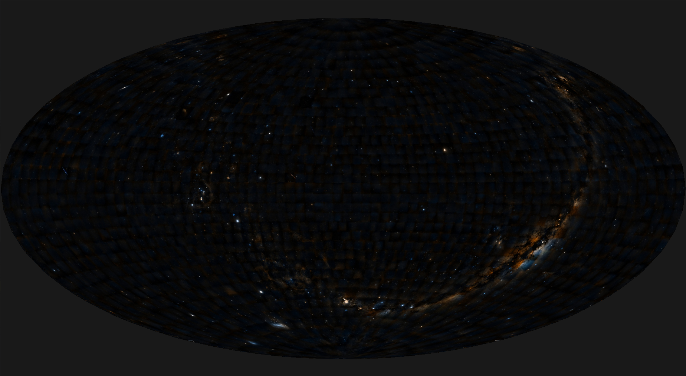

# All sky rendering using WebGPU

## Live demo [here](https://bmatthieu3.github.io/sky_rendering_wgpu/index.html)

## What is it ?

An example showing the rendering of allsky projections using wgpu-rs.
Allsky projections are used in many ways to represented the earth or the sky on a 2d plane.
This method does the projection per-pixel and runs in realtime.



Supported projections are:
* [Aitoff](https://en.wikipedia.org/wiki/Aitoff_projection)
* [Mercator](https://en.wikipedia.org/wiki/Mercator_projection)
* [Mollweide](https://en.wikipedia.org/wiki/Mollweide_projection)
* [Azimuthal](https://en.wikipedia.org/wiki/Azimuthal_equidistant_projection)
* [Gnomonic](https://en.wikipedia.org/wiki/Gnomonic_projection)

See this [link](https://en.wikipedia.org/wiki/List_of_map_projections) for information about map projections.

## How it works

If you want more precision about the algorithm and techniques used:
* Read this [article](https://bmatthieu3.github.io/posts/allskyrendering/) I wrote on my personal blog.
* See my talk at ADASS 2020 at this [link](https://www.youtube.com/watch?v=TILtJOiiRoc).

### Test as a native application

```sh
# Run
$ cargo run --release
```

### Test on the browser (WIP)

1. Install [wasm-pack](https://rustwasm.github.io/wasm-pack/installer/)

2. Install dev dependencies (e.g. vite)

```sh
npm install
```

3. Test the web (WASM) version

```sh
npm run demo
```
